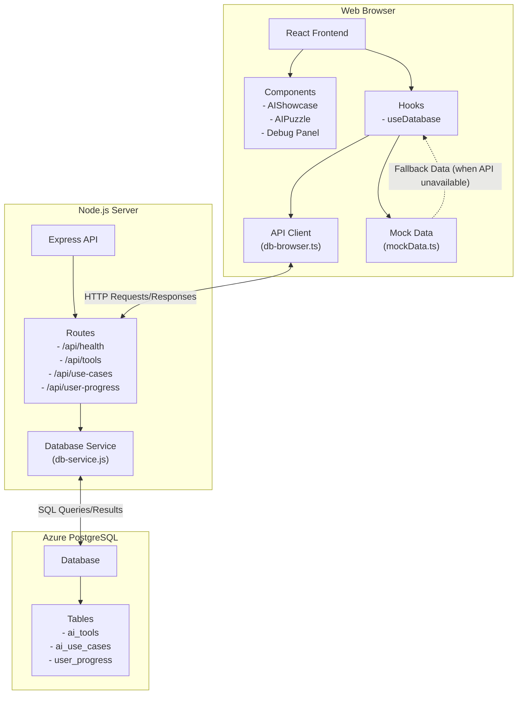

# Client-Server Architecture Diagrams

This document provides different architecture diagram options for the AI Puzzle Site.

## ASCII Art Diagram (Already in client-server-architecture.md)

For simple text-based representation.

## Mermaid Diagram



## PlantUML Diagram

For more detailed UML-style diagrams.

```
@startuml
package "Web Browser" {
  [React Frontend] as Frontend
  package "Components" {
    [AIShowcase]
    [AIPuzzle]
    [DebugPanel]
  }
  package "Hooks" {
    [useDatabase]
  }
  [API Client\n(db-browser.ts)] as ApiClient
  [Mock Data\n(mockData.ts)] as MockData
  
  Frontend --> AIShowcase
  Frontend --> AIPuzzle
  Frontend --> DebugPanel
  Frontend --> useDatabase
  useDatabase --> ApiClient
  useDatabase --> MockData : "fallback"
}

package "Node.js Server" {
  [Express API] as API
  [API Routes] as Routes
  [Database Service\n(db-service.js)] as DbService
  
  API --> Routes
  Routes --> DbService
}

database "Azure PostgreSQL" {
  frame "Tables" {
    [ai_tools]
    [ai_use_cases]
    [user_progress]
  }
}

ApiClient <--> Routes : HTTP
DbService <--> [ai_tools] : SQL
DbService <--> [ai_use_cases] : SQL
DbService <--> [user_progress] : SQL

@enduml
```

## Data Flow Diagram

```
+----------------+        +-----------------+        +----------------+
| User Interface |        |  Business Logic |        |  Data Storage  |
+----------------+        +-----------------+        +----------------+
| - React UI     |        | - Express API   |        | - PostgreSQL   |
| - Components   |  HTTP  | - Route Handlers|  SQL   | - Tables:      |
| - State Mgmt   | -----> | - Data Validate | -----> |   * ai_tools   |
| - API Client   | <----- | - Error Handling| <----- |   * ai_use_cases|
| - Mock Data    |  JSON  | - Auth (future) |  Data  |   * user_progress|
+----------------+        +-----------------+        +----------------+
```
